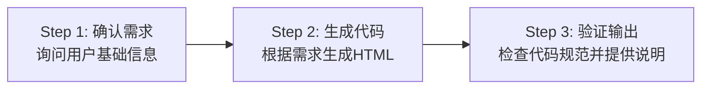

# 微应用开发 Skill (MicroApp Development)

> **Skill 说明**：此 Skill 专为营销通微应用开发设计，提供完整的开发规范、API 参考和最佳实践。使用此 Skill 可以快速生成符合规范的抽奖、签到、问卷等互动微应用代码。

> **🚨 重要提示**：使用此 Skill 时，**必须先完成需求确认（Step 1）再生成代码**。请勿跳过工作流程直接生成代码。

---

## Skill 元信息

| 属性 | 值 |
|------|-----|
| **名称** | `microapp-development` |
| **版本** | 1.0.7 |
| **适用场景** | 开发营销通微应用（会议签到抽奖、会议签到、问卷等） |
| **目标用户** | 前端开发者、AI 编程助手 |
| **输出格式** | 单个 HTML 文件（ES5 语法） |

---

## 🚀 快速开始（Quick Start）

> ⚠️ **第一步永远是确认需求，不要直接生成代码！**

### 三步工作流程



### Step 1: 确认需求 ⛔ **必须执行，不可跳过**

在生成任何代码之前，**必须先询问用户**以下信息：

1. **应用类型**：
   - `lottery-signin` - 会议签到抽奖（完整功能）
   - `signin` - 会议签到（无抽奖，突出签到用户列表）
   - `lottery` - 抽奖应用（与会议无关，CTA引导后抽奖）
   - `survey` - 问卷
   - `other` - 其他
2. **目标平台**：移动端 / PC端 / 双端（签到类默认双端）
3. **设计风格**：cyber（赛博霓虹）/ ink（东方水墨）/ crystal（晶体折射）/ celebration（庆典纸屑）
4. **根据应用类型询问核心信息**：

   **会议签到抽奖 (`lottery-signin`) - 默认功能**：
   - ✅ 抽奖能力（多轮抽奖、中奖展示、中奖名单）
   - ✅ 签到用户列表（实时更新）
   - ✅ 互动消息滚动列表（接收移动端消息）
   - ✅ 签到二维码生成（供参会者扫码）
   - ✅ 奖项编辑新增（动态设置奖项）
   - 需确认：**奖项设置**（一等奖1名、二等奖3名...）
   - 需确认：**实现方式**：
     - ✅ **默认方式**：在数据库中新建签到人员表，自主管理签到和抽奖数据
     - ⬜ **系统对接方式**：调用参会人员API（`FsYxtMicroApp.queryConferenceParticipants`）查询系统参会人员，使用会议签到API（`FsYxtMicroApp.conferenceSignIn`）进行签到

   **会议签到 (`signin`) - 默认功能**：
   - ✅ 会议签到（用户信息自动填充/手动输入）
   - ✅ 3D签到球效果（PC端）
   - ✅ 头像飞入动画+粒子特效
   - ✅ 签到用户列表（**重点突出展示**）
   - ✅ 互动消息滚动列表
   - ✅ 签到二维码生成
   - 需确认：是否需要额外信息收集？
   - 需确认：**是否需要集成CTA引导**？（如需CTA则用户需完成CTA后才能签到）
   - 需确认：**实现方式**：
     - ✅ **默认方式**：在数据库中新建签到人员表
     - ⬜ **系统对接方式**：调用活动成员API + 会议签到API

   **抽奖应用 (`lottery`)**：
   - ✅ 抽奖能力（多轮抽奖、中奖展示、中奖名单）
   - ✅ 抽奖前引导（CTA引导完成后才能抽奖）
   - 需确认：**是否需要集成CTA引导**？
     - 如需集成CTA：询问用户提供 `ctaId`（或默认从业务参数 `ctaId` 获取）
     - 不集成CTA：用户可直接参与抽奖
   - 需确认：**奖项设置**（一等奖1名、二等奖3名...）
   - **适用场景**：与会议无关的纯抽奖活动，如产品发布会的抽奖环节

   **问卷 (`survey`)**：
   - 需确认：**问卷内容和选项**

   **其他 (`other`)**：
   - 需确认：简单描述功能需求

> 📌 **为什么不能跳过这一步？**
> - 不同应用类型需要不同的数据结构
> - 不同平台需要不同的UI布局
> - 不同风格需要不同的CSS变量
> - 避免生成不符合用户需求的代码

### Step 2: 生成代码

根据确认的需求，生成符合规范的完整 HTML 文件

### Step 3: 验证输出

检查代码并提供使用说明

---

## 使用说明

### 给 AI 助手的指令

将以下内容发送给 AI 助手（ChatGPT、Claude、通义千问等）：

```
请使用 microapp-development skill 帮我开发一个 [具体功能，如：会议抽奖] 微应用。
```

### 给 Skill 的参数

开发微应用时需要指定以下参数：

| 参数 | 说明 | 示例值 |
|------|------|--------|
| `appType` | 应用类型 | `lottery`（抽奖）、`signin`（签到）、`survey`（问卷） |
| `platform` | 目标平台 | `mobile`（移动端）、`web`（PC 端）、`both`（双端） |
| `designStyle` | 设计风格 | `cyber`（赛博霓虹）、`ink`（东方水墨）、`crystal`（晶体折射）、`celebration`（庆典纸屑） |

---

## 核心规范

### 1. 代码规范 - ES5 语法 ⚠️

微应用代码直接注入浏览器执行，**必须严格使用 ES5 语法**。

#### 禁止使用的 ES6+ 语法

```javascript
// ❌ 禁止使用
const/let              // 必须使用 var
() => {}              // 必须使用 function()
`${}`                  // 必须使用字符串拼接
class                 // 必须使用 function 构造器
async/await           // 必须使用 Promise.then()
?. / ??               // 可选链和空值合并
for...of / forEach    // 必须使用 for 循环
```

#### 正确写法示例

```javascript
// ✅ 变量声明
var userName = '张三';
var isLoggedIn = true;

// ✅ 函数定义
function createUser(name, email) {
  return {
    name: name,
    email: email,
    createdAt: Date.now()
  };
}

// ✅ 立即执行函数
(function() {
  var app = {
    init: function() {
      console.log('App initialized');
    }
  };
  app.init();
})();

// ✅ 字符串拼接
var message = '用户：' + userName + '，您好！';

// ✅ 数组遍历
var users = [{name: '张三'}, {name: '李四'}];
for (var i = 0; i < users.length; i++) {
  console.log(users[i].name);
}

// ✅ Promise 使用
FsYxtMicroApp.getCurrentUser().then(function(user) {
  console.log('当前用户：', user.name);
}).catch(function(err) {
  console.error('获取用户失败：', err);
});
```

### 2. SDK 引入

```html
<!DOCTYPE html>
<html lang="zh-CN">
<head>
  <meta charset="UTF-8" />
  <meta name="viewport" content="width=device-width, initial-scale=1.0" />
  <title>微应用标题</title>

  <!-- 引入 Mock SDK（开发环境） -->
  <script src="https://ceshi112.fspage.com/ec/h5-landing/release/microAppMockSDK.js"></script>

  <style>
    /* CSS 样式 */
  </style>
</head>
<body>
  <!-- HTML 结构 -->

  <script>
    // JavaScript 代码
  </script>
</body>
</html>
```

### 3. SDK 可用性检查

```javascript
// 检查 SDK 是否可用
function isSdkAvailable() {
  return typeof FsYxtMicroApp !== 'undefined';
}

// 安全的 API 调用封装
function safeApiCall(apiFunc, fallbackValue) {
  if (isSdkAvailable() && apiFunc) {
    return apiFunc();
  }
  return Promise.resolve(fallbackValue);
}

// 使用示例
safeApiCall(FsYxtMicroApp.getCurrentUser, null).then(function(user) {
  if (user) {
    console.log('用户：', user.name);
  } else {
    console.warn('未获取到用户，请检查 SDK');
  }
});
```

---

## API 参考

### 数据库操作

```javascript
// 创建记录
FsYxtMicroApp.db.create('campaign_members', {
  name: '张三',
  mobile: '13800138000',
  status: '已签到',
  signInTime: Date.now()
});

// 查询记录
FsYxtMicroApp.db.query('campaign_members', {
  filter: { status: '已签到' },
  pageSize: 100,
  pageNum: 1
});

// 更新记录
FsYxtMicroApp.db.update('campaign_members', 'record_id', {
  status: '已中奖',
  isWinner: true,
  prizeType: '一等奖'
});

// 删除记录
FsYxtMicroApp.db.delete('campaign_members', 'record_id');
```

**活动成员表数据结构（campaign_members）**：

```javascript
{
  name: '张三',                // 姓名（必填）
  mobile: '13800138000',       // 手机号（必填）
  email: 'test@example.com',   // 邮箱
  department: '技术部',        // 部门
  status: '已签到',           // 状态
  campaignId: 'cmp_001',      // 活动 ID
  contactId: 'con_001',       // 联系人 ID
  userType: 'employee',       // 用户类型：employee/member/visitor
  signUpTime: 1234567890,     // 报名时间
  signInTime: 1234567900,     // 签到时间
  isWinner: false,            // 是否中奖
  prizeType: null             // 奖项类型
}
```

### 用户信息

```javascript
// 获取当前用户
FsYxtMicroApp.getCurrentUser().then(function(user) {
  console.log(user);
  // {
  //   ea: 'enterprise_001',           // 企业ID
  //   memberId: 'member_123',         // 会员ID（存在时表示企业会员）
  //   fsUserId: 12345,                // 员工ID（存在时表示企业员工）
  //   openId: 'wx_openid_123',
  //   wxAppId: 'wx_appid_456',
  //   fingerPrint: 'fp_abc123',
  //   name: '张三',
  //   mobile: '13800138000',
  //   avatar: 'https://...',
  //   department: '技术部',
  //   userType: 'employee'            // 身份类型：employee/member/visitor
  // }

  // 根据用户身份类型做不同处理
  if (user.userType === 'employee') {
    console.log('企业员工');
  } else if (user.userType === 'member') {
    console.log('企业会员');
  } else {
    console.log('企业访客');
  }
});
```

### 会议签到

```javascript
// 会议签到（需在 URL 中设置 marketingEventId 参数）
// 参数：options.contact - 手机号或邮箱
FsYxtMicroApp.conferenceSignIn({ contact: '13800138000' })
  .then(function(result) {
    console.log('签到成功：', result);
  })
  .catch(function(err) {
    console.error('签到失败：', err);
  });
```

### 参会人员查询

查询营销活动（会议）的参会人员列表，用于系统对接方式获取系统参会数据。

```javascript
// 查询参会人员列表
// 参数：
// - marketingEventId: 营销活动ID（必填，可从 URL 参数获取）
// - pageNum: 页码，默认1
// - pageSize: 每页数量，默认10，最大100
// - reviewStatus: 审批状态（可选）：pending（待审批）、approved（已通过）、rejected（已拒绝）
// - signStatus: 签到状态（可选）：not_signed（未签到）、signed（已签到）
// - keyword: 关键字搜索（可选），支持姓名、手机号模糊匹配
// - filterPhoneUser: 是否过滤已绑定手机的用户（可选）：true/false，默认false

FsYxtMicroApp.queryConferenceParticipants({
  marketingEventId: FsYxtMicroApp.getParam('marketingEventId'),
  pageNum: 1,
  pageSize: 100,
  reviewStatus: 'approved',    // 只查询已通过审批的
  signStatus: 'signed',        // 只查询已签到的
  keyword: '',
  filterPhoneUser: false
})
  .then(function(result) {
    console.log('参会人员列表：', result.data);
    // 返回格式：{ data: [...], total: 100, pageNum: 1, pageSize: 100 }
  })
  .catch(function(err) {
    console.error('查询失败：', err);
  });
```

**返回数据字段说明：**
| 字段 | 类型 | 说明 |
|------|------|------|
| id | string | 参会人员ID |
| name | string | 姓名 |
| phone | string | 手机号 |
| email | string | 邮箱 |
| company | string | 公司 |
| position | string | 职位 |
| reviewStatus | string | 审批状态 |
| signStatus | string | 签到状态 |
| signInTime | string | 签到时间 |

**前置要求：**
- 需在 URL 业务参数中设置 `marketingEventId`

**典型应用场景：**
1. 会议签到抽奖：查询已签到人员作为抽奖池
2. 参会人员统计：查询已报名人员列表
3. 签到状态查询：实时获取签到情况

### CTA 引导

CTA（Call To Action）SDK 用于在网页中嵌入引导组件，用户完成引导后才能参与抽奖。

**1. 引入 SDK**

在 HTML 文件中引入 CTA SDK：
```html
<script src="https://www.fxiaoke.com/ec/h5-landing/release/ctaSDK-1.0.0.js"></script>
```

**2. 基本用法**

```javascript
// 获取 ctaId（优先从业务参数获取，否则使用默认值）
var ctaId = FsYxtMicroApp.getParam('ctaId') || 'default-cta-id';

// 创建 CTA 实例
var cta = FsYxt.CtaSDK({
    ctaId: ctaId
});

// 监听准备就绪事件
cta.onReady(function() {
    console.log('CTA 组件已准备就绪');
});

// 监听错误事件
cta.onError(function(error) {
    console.error('CTA 错误：', error);
});

// 监听引导完成事件（抽奖应用需要用到）
cta.onActionComplete(function() {
    console.log('引导完成，解锁抽奖功能');
    // 显示抽奖界面或启用抽奖按钮
    document.getElementById('lottery-section').style.display = 'block';
});

// 手动触发 CTA（可选，取决于 autoExecuteOnReady 配置）
// cta.start();
```

**3. 抽奖应用完整流程示例**

```javascript
// 页面加载完成后初始化
window.addEventListener('load', function() {
    // 检查是否需要 CTA 引导
    var ctaId = FsYxtMicroApp.getParam('ctaId');

    if (ctaId) {
        // 需要 CTA 引导
        var cta = FsYxt.CtaSDK({
            ctaId: ctaId,
            autoExecuteOnReady: true,
            marketingEventId: FsYxtMicroApp.getParam('marketingEventId')
        });

        // 隐藏抽奖区域，等待 CTA 完成
        document.getElementById('lottery-section').style.display = 'none';

        cta.onReady(function() {
            console.log('CTA 已就绪');
        });

        cta.onActionComplete(function() {
            console.log('CTA 引导完成，解锁抽奖');
            // 显示抽奖区域
            document.getElementById('lottery-section').style.display = 'block';
            // 启用抽奖按钮
            document.getElementById('lottery-btn').disabled = false;
        });

        cta.onError(function(error) {
            console.error('CTA 出错：', error);
            // CTA 出错时仍显示抽奖（降级处理）
            document.getElementById('lottery-section').style.display = 'block';
        });
    } else {
        // 不需要 CTA，直接显示抽奖
        document.getElementById('lottery-section').style.display = 'block';
    }
});
```

**4. 构造函数选项**

| 参数 | 类型 | 必填 | 默认值 | 说明 |
|------|------|------|--------|------|
| ctaId | string | 是 | - | CTA 组件的唯一标识 |
| hideEntryBtn | boolean | 否 | false | 是否隐藏默认引导按钮 |
| autoExecuteOnReady | boolean | 否 | true | 是否在准备就绪后自动执行 |
| marketingEventId | string | 否 | - | 市场活动 ID |
| buttonId | string | 否 | - | 自定义触发按钮的 ID |
| actionStyle | object | 否 | - | 样式配置对象 |

**5. 样式配置选项**

| 参数 | 类型 | 默认值 | 说明 |
|------|------|--------|------|
| position | string | 'center' | 组件弹出位置：'center'（居中）、'bottom-right'（右下角） |
| maskOpacity | number | 0.6 | 遮罩层透明度，取值范围 0-1 |
| width | string | '280px' | 表单弹窗宽度，支持 px、%、vw 等单位 |
| borderRadius | string | '6px' | 弹层圆角 |

**6. 实例方法**

| 方法 | 说明 |
|------|------|
| onReady(callback) | 监听组件准备就绪事件 |
| onError(callback) | 监听错误事件 |
| start() | 手动触发 CTA 引导组件 |
| onActionComplete(callback) | 监听引导完成事件 |
| onActionStep(callback) | 监听引导步骤事件 |
| destroy() | 销毁 CTA 实例 |

### 消息广播

```javascript
// 广播消息
FsYxtMicroApp.broadcast({
  type: 'lottery_result',    // 消息类型（必填）
  data: { winner: '...' },   // 消息数据
  to: 'all'  // 接收者：'all'、userId 或 [userId1, userId2, ...]
});

// 监听消息
var unsubscribe = FsYxtMicroApp.onMessage(function(message) {
  if (message.type === 'lottery_result') {
    console.log('中奖者：', message.data.winner);
  }
});

// 取消监听
unsubscribe();

// 启动/停止消息轮询（可选）
FsYxtMicroApp.startMessagePolling(3000);  // 3秒轮询一次
FsYxtMicroApp.stopMessagePolling();
```

### 数据存储

```javascript
// 应用私有数据（服务端 KV 存储，跨设备同步，异步操作）
FsYxtMicroApp.storeAppData('key', value).then(function() {
  console.log('数据已保存');
}).catch(function(err) {
  console.error('保存失败:', err);
});

FsYxtMicroApp.getAppData('key').then(function(value) {
  console.log('数据:', value);
}).catch(function(err) {
  console.error('读取失败:', err);
});

// 数据库存储（结构化数据，支持复杂查询）
FsYxtMicroApp.db.create('tableName', data);
FsYxtMicroApp.db.query('tableName', query);
FsYxtMicroApp.db.update('tableName', id, data);
FsYxtMicroApp.db.delete('tableName', id);
```

### 其他 API

```javascript
// 平台判断
var platform = FsYxtMicroApp.platform;  // 'mobile' 或 'web'

// 埋点上报
// 查看应用活动
FsYxtMicroApp.track(2035);

// 参加应用活动
FsYxtMicroApp.track(2036);

// 参加活动并中奖
FsYxtMicroApp.track(2036, '中了一等奖');
```

---

## 数据模型

### 活动成员表 (campaign_members)

> 说明：这是自定义数据表，使用 `FsYxtMicroApp.db.*` API 操作

| 字段 | 类型 | 必填 | 说明 |
|------|------|------|------|
| `name` | String | ✅ | 姓名 |
| `phone` | String | ✅ | 手机号 |
| `email` | String | ❌ | 邮箱 |
| `department` | String | ❌ | 部门 |
| `status` | String | ❌ | 状态：未报名/已报名/已签到/已中奖 |
| `campaignId` | String | ✅ | 活动 ID |
| `contactId` | String | ❌ | 联系人 ID |
| `signUpTime` | Number | ❌ | 报名时间戳 |
| `signInTime` | Number | ❌ | 签到时间戳 |
| `isWinner` | Boolean | ❌ | 是否中奖 |
| `prizeType` | String | ❌ | 奖项类型 |

### 中奖记录 (lottery_winners)

| 字段 | 类型 | 必填 | 说明 |
|------|------|------|------|
| `winnerId` | String | ✅ | 中奖者 ID |
| `winnerName` | String | ✅ | 中奖者姓名 |
| `winnerPhone` | String | ❌ | 中奖者手机号 |
| `winnerDepartment` | String | ❌ | 中奖者部门 |
| `prizeType` | String | ✅ | 奖项类型 |
| `prizeName` | String | ✅ | 奖品名称 |
| `prizeValue` | Number | ❌ | 奖品价值 |
| `campaignId` | String | ❌ | 活动 ID |
| `round` | Number | ✅ | 抽奖轮次 |
| `drawTime` | Number | ✅ | 抽奖时间戳 |

### 奖项配置 (prizes - 应用数据)

```javascript
[
  { name: '一等奖', count: 1, prizeName: 'iPhone 15', prizeValue: 5999 },
  { name: '二等奖', count: 3, prizeName: 'iPad Air', prizeValue: 3999 },
  { name: '三等奖', count: 10, prizeName: '小米手环', prizeValue: 299 }
]
```

---

## 应用类型功能对比

> 本章节汇总不同应用类型的标准功能模块，帮助快速理解各场景的默认功能配置。

### 会议签到抽奖 (`lottery-signin`)

**适用场景**：会议、年会、活动等需要签到和抽奖的完整场景

| 功能模块 | 移动端 | PC端 | 说明 |
|---------|--------|------|------|
| **签到能力** | ✅ 主功能 | ✅ 状态显示 | 用户信息自动填充、签到状态管理 |
| **签到用户列表** | - | ✅ 实时展示 | PC端显示所有已签到用户、人数统计 |
| **互动消息滚动** | ✅ 发送 | ✅ 接收展示 | 移动端发送消息、PC端大屏滚动展示 |
| **签到二维码** | - | ✅ 生成展示 | PC端生成二维码、参会者扫码签到 |
| **抽奖能力** | - | ✅ 主功能 | 多轮抽奖、中奖动画、中奖名单 |
| **奖项管理** | - | ✅ 编辑新增 | 动态添加奖项、设置奖品和数量 |

**双端联动机制**：
- 移动端签到 → PC端实时刷新用户列表
- 移动端发送消息 → PC端滚动展示
- PC端抽奖 → 移动端接收中奖通知

---

### 会议签到 (`signin`)

**适用场景**：只需签到功能，无需抽奖的场景（如培训签到、会议签到）

| 功能模块 | 移动端 | PC端 | 说明 |
|---------|--------|------|------|
| **签到能力** | ✅ 主功能 | ✅ 状态显示 | 用户信息自动填充、签到状态管理 |
| **签到用户列表** | - | ✅ **重点展示** | **大字体卡片布局**、实时更新、人数统计 |
| **互动消息滚动** | ✅ 发送 | ✅ 接收展示 | 移动端发送消息、PC端大屏滚动展示 |
| **签到二维码** | - | ✅ 生成展示 | PC端生成二维码、参会者扫码签到 |

**重点设计说明**：
- **PC端布局**：签到用户列表占据主要视觉区域（约60-70%空间）
- **用户卡片**：大字体显示姓名、部门、签到时间
- **实时统计**：显示已签到人数/预计参会人数
- **动画效果**：最新签到用户高亮显示（淡入+缩放动画）
- **筛选功能**：支持按部门、签到时间筛选

---

### 问卷 (`survey`)

**适用场景**：数据收集、满意度调查等

| 功能模块 | 移动端 | PC端 | 说明 |
|---------|--------|------|------|
| **问卷填写** | ✅ 主功能 | ✅ 主功能 | 单选/多选/填空题 |
| **结果统计** | - | ✅ 数据看板 | 图表展示、数据导出 |

---

### 功能矩阵总览

| 功能 | lottery-signin | signin | survey |
|------|----------------|--------|--------|
| 用户签到 | ✅ | ✅ | - |
| 签到用户列表（重点展示） | ✅ | ✅ **重点** | - |
| 互动消息 | ✅ | ✅ | - |
| 签到二维码 | ✅ | ✅ | - |
| 抽奖功能 | ✅ | - | - |
| 奖项管理 | ✅ | - | - |
| 问卷填写 | - | - | ✅ |
| 数据统计 | - | - | ✅ |

---

## UI 设计规范

所有微应用应遵循以下 UI 设计规范：

### 基础规范

```css
:root {
  /* 默认主题色 - 活力橙 */
  --theme-color: #ff8000;
  --theme-color-dark: #e67300;
  --theme-color-light: #ff9933;

  /* 默认圆角 */
  --border-radius: 8px;
  --border-radius-sm: 4px;
  --border-radius-lg: 12px;

  /* 间距系统 */
  --spacing-xs: 4px;
  --spacing-sm: 8px;
  --spacing-md: 16px;
  --spacing-lg: 24px;
  --spacing-xl: 32px;

  /* 字体大小 */
  --font-size-xs: 12px;
  --font-size-sm: 14px;
  --font-size-md: 16px;
  --font-size-lg: 20px;
  --font-size-xl: 24px;
  --font-size-xxl: 32px;

  /* 阴影 */
  --shadow-sm: 0 2px 4px rgba(0, 0, 0, 0.1);
  --shadow-md: 0 4px 8px rgba(0, 0, 0, 0.15);
  --shadow-lg: 0 8px 16px rgba(0, 0, 0, 0.2);
}
```

### 主题色规范

| 用途 | 颜色值 | 说明 |
|------|--------|------|
| 主色 | `#ff8000` | 默认主题色，用于主要按钮、强调文字、图标 |
| 主色深色 | `#e67300` | 主色的深色版本，用于 hover 状态 |
| 主色浅色 | `#ff9933` | 主色的浅色版本，用于背景、描边 |
| 背景色 | `#ffffff` | 页面背景色 |
| 卡片背景 | `#f8f8f8` | 卡片、列表项背景 |
| 文字主色 | `#333333` | 主要文字颜色 |
| 文字次色 | `#666666` | 次要文字颜色 |
| 文字禁用 | `#999999` | 禁用状态文字 |
| 边框色 | `#e5e5e5` | 边框、分割线 |
| 成功色 | `#52c41a` | 成功状态 |
| 警告色 | `#faad14` | 警告状态 |
| 错误色 | `#f5222d` | 错误状态 |

### 圆角规范

| 用途 | 圆角值 |
|------|--------|
| 按钮 | `8px` |
| 输入框 | `8px` |
| 卡片 | `8px` |
| 小元素（标签、徽章） | `4px` |
| 大元素（弹窗、面板） | `12px` |

### 组件样式示例

**按钮**
```css
.button {
  background-color: #ff8000;
  color: #ffffff;
  border-radius: 8px;
  padding: 10px 20px;
  font-size: 16px;
  border: none;
  cursor: pointer;
  transition: all 0.3s ease;
}

.button:hover {
  background-color: #e67300;
  transform: translateY(-2px);
  box-shadow: 0 4px 12px rgba(255, 128, 0, 0.3);
}

.button:active {
  transform: translateY(0);
}

.button:disabled {
  background-color: #cccccc;
  cursor: not-allowed;
}
```

**输入框**
```css
.input {
  border: 1px solid #e5e5e5;
  border-radius: 8px;
  padding: 10px 14px;
  font-size: 14px;
  transition: border-color 0.3s ease;
}

.input:focus {
  border-color: #ff8000;
  outline: none;
  box-shadow: 0 0 0 2px rgba(255, 128, 0, 0.2);
}
```

**卡片**
```css
.card {
  background-color: #ffffff;
  border-radius: 8px;
  padding: 16px;
  box-shadow: 0 2px 8px rgba(0, 0, 0, 0.1);
}
```

### 响应式断点

```css
/* 移动端 */
@media screen and (max-width: 768px) {
  :root {
    --font-size-md: 14px;
    --font-size-lg: 18px;
    --spacing-md: 12px;
  }
}

/* 平板 */
@media screen and (min-width: 769px) and (max-width: 1024px) {
  :root {
    --font-size-md: 15px;
  }
}

/* PC端 */
@media screen and (min-width: 1025px) {
  :root {
    --font-size-md: 16px;
  }
}
```

### 无障碍规范

- 按钮、链接等可交互元素需要有明显的 `:focus` 状态
- 颜色对比度需符合 WCAG 2.1 标准（文字与背景对比度至少 4.5:1）
- 所有图片需要添加 `alt` 属性
- 表单元素需要关联对应的 `label` 标签

---

## 设计风格

### 风格 A：赛博霓虹脉冲 (cyber)

```css
:root {
  --bg-color: #0a0e27;
  --neon-pink: #ff00ff;
  --neon-cyan: #00ffff;
  --neon-yellow: #ffff00;
}

body {
  background: var(--bg-color);
}

.neon-text {
  color: var(--neon-cyan);
  text-shadow: 0 0 10px var(--neon-cyan), 0 0 20px var(--neon-cyan);
}

.neon-button {
  background: linear-gradient(90deg, var(--neon-pink), var(--neon-cyan));
  box-shadow: 0 0 20px var(--neon-pink);
}
```

### 风格 B：东方水墨流动 (ink)

```css
:root {
  --bg-color: #f5f0e6;
  --ink-red: #c8362e;
  --ink-gold: #d4af37;
}

body {
  background: var(--bg-color);
}

.ink-card {
  background: #fff;
  border-radius: 8px;
  border: 1px solid var(--ink-gold);
}

.ink-text {
  color: var(--ink-red);
  font-weight: bold;
}
```

### 风格 C：晶体几何折射 (crystal)

```css
:root {
  --bg-color: #ffffff;
  --glass-bg: rgba(255, 255, 255, 0.2);
  --prism-gradient: linear-gradient(135deg, #667eea 0%, #764ba2 100%);
}

body {
  background: var(--bg-color);
}

.glass-card {
  background: var(--glass-bg);
  backdrop-filter: blur(10px);
  border: 1px solid rgba(255, 255, 255, 0.3);
}
```

### 风格 D：庆典纸屑狂欢 (celebration)

```css
:root {
  --bg-color: #fff5f5;
  --festive-red: #e63946;
  --gold-gradient: linear-gradient(135deg, #f5d061, #e6a04e);
}

body {
  background: var(--bg-color);
}

.festive-button {
  background: var(--gold-gradient);
  color: #fff;
  border-radius: 25px;
  box-shadow: 0 4px 15px rgba(230, 57, 70, 0.3);
}
```

---

## 平台判断

```javascript
function getPlatform() {
  // 优先使用 SDK 判断
  if (typeof FsYxtMicroApp !== 'undefined' && FsYxtMicroApp.platform) {
    return FsYxtMicroApp.platform;
  }
  // 降级到屏幕宽度判断
  return window.innerWidth < 768 ? 'mobile' : 'web';
}

var platform = getPlatform();

if (platform === 'mobile') {
  // 移动端代码
} else {
  // PC 端代码
}
```

---

## URL 参数处理

> **重要**：微应用访问地址中的参数（`ea`、`appId`、`marketingEventId` 等）**自动从 URL 中获取**，无需询问用户。

### 参数获取方法

使用 `URLSearchParams` 解析 URL 参数：

```javascript
// 获取 URL 参数的通用函数
function getUrlParam(name) {
  var urlParams = new URLSearchParams(window.location.search);
  return urlParams.get(name) || '';
}

// 获取常用参数
var ea = getUrlParam('ea');                    // 企业 ID（必需）
var appId = getUrlParam('appId');              // 应用 ID（必需）
var marketingEventId = getUrlParam('marketingEventId'); // 营销活动 ID（可选）
```

### 微应用访问地址拼接规则

| 项目 | 说明 |
|------|------|
| **基础地址** | `https://crm.ceshi112.com/proj/page/marketing-microapp` |
| **必需参数** | `ea`（企业 ID）、`appId`（应用 ID） |
| **可选参数** | `marketingEventId`（营销活动 ID） |
| **完整示例** | `https://crm.ceshi112.com/proj/page/marketing-microapp?ea=123456&appId=app_001&marketingEventId=event_123` |

### 二维码生成

PC 端生成签到二维码时，使用当前页面的 URL（包含已有参数）：

```javascript
// 获取当前页面完整 URL
var currentUrl = window.location.href;

// 或手动拼接
var ea = getUrlParam('ea');
var appId = getUrlParam('appId');
var qrUrl = 'https://crm.ceshi112.com/proj/page/marketing-microapp?ea=' + ea + '&appId=' + appId;

// 生成二维码
var qrCodeUrl = 'https://api.qrserver.com/v1/create-qr-code/?size=300x300&data=' + encodeURIComponent(qrUrl);
document.getElementById('qr-code').innerHTML = '';
```

---

## 完整示例：会议现场签到抽奖（双端联动）

> **场景说明**：这是一个完整的会议现场签到抽奖系统，PC端显示大屏供主持人操作，移动端供参会人员签到和互动。

### 功能说明

**PC端（大屏）功能：**
- 签到用户列表实时显示（每5秒自动刷新）
- 互动消息滚动展示（接收移动端发送的消息）
- 奖项设置管理
- 抽奖功能（支持多轮抽奖）
- 签到二维码展示
- 中奖名单展示
- **消息轮询机制**：启动消息轮询（每3秒），接收移动端的广播消息

**移动端功能：**
- 自动获取用户信息并填充（支持手动输入降级）
- 用户签到（点击按钮触发）
- 互动消息发送
- 实时接收中奖通知

**双端联动实现原理：**
- **移动端 → PC端**：
  - 移动端调用 `broadcast()` 发送消息
  - PC端通过 `startMessagePolling()` 轮询接收消息
  - PC端收到签到消息后刷新用户列表
  - PC端收到互动消息后添加到滚动区域
- **PC端 → 移动端**：
  - PC端抽奖后调用 `broadcast()` 广播中奖结果
  - 移动端通过 `onMessage()` 监听，收到中奖通知后弹窗提示

```html
<!DOCTYPE html>
<html lang="zh-CN">
<head>
  <meta charset="UTF-8" />
  <meta name="viewport" content="width=device-width, initial-scale=1.0" />
  <title>会议签到抽奖</title>
  <script src="https://ceshi112.fspage.com/ec/h5-landing/release/microAppMockSDK.js"></script>
  <style>
    * { margin: 0; padding: 0; box-sizing: border-box; }
    body { font-family: Arial, sans-serif; }

    /* 移动端样式 */
    .mobile-container { padding: 20px; max-width: 600px; margin: 0 auto; }
    .mobile-header { text-align: center; margin-bottom: 30px; }
    .mobile-header h1 { font-size: 24px; color: #333; }
    .user-card { background: #f5f5f5; padding: 20px; border-radius: 10px; margin-bottom: 20px; }
    .btn { width: 100%; padding: 15px; border: none; border-radius: 8px; font-size: 16px; cursor: pointer; }
    .btn-primary { background: linear-gradient(135deg, #667eea 0%, #764ba2 100%); color: white; }
    .btn-disabled { background: #ccc; color: #999; cursor: not-allowed; }
    .message-input { margin-top: 20px; }
    .message-input textarea { width: 100%; padding: 10px; border: 1px solid #ddd; border-radius: 8px; min-height: 80px; }
    .message-list { margin-top: 20px; }
    .message-item { background: #f9f9f9; padding: 10px; margin-bottom: 10px; border-radius: 8px; font-size: 14px; }

    /* PC端大屏样式 */
    .pc-container { display: none; height: 100vh; background: linear-gradient(135deg, #0a0e27 0%, #1a1a3e 100%); color: white; }
    .pc-header { display: flex; justify-content: space-between; align-items: center; padding: 20px 40px; background: rgba(0,0,0,0.3); }
    .pc-title { font-size: 28px; font-weight: bold; }
    .pc-stats { display: flex; gap: 40px; font-size: 18px; }
    .stat-item { text-align: center; }
    .stat-value { font-size: 32px; font-weight: bold; color: #00ffff; }
    .pc-content { display: flex; height: calc(100vh - 80px); }
    .pc-left { flex: 1; padding: 20px; overflow-y: auto; }
    .pc-center { flex: 1; padding: 20px; display: flex; flex-direction: column; align-items: center; justify-content: center; }
    .pc-right { flex: 1; padding: 20px; border-left: 1px solid rgba(255,255,255,0.1); }
    .section-title { font-size: 18px; margin-bottom: 15px; color: #00ffff; }
    .user-list-item { background: rgba(255,255,255,0.1); padding: 12px; margin-bottom: 8px; border-radius: 6px; font-size: 14px; }
    .message-scroll { height: 300px; overflow: hidden; position: relative; }
    .message-scroll-item { padding: 10px; background: rgba(102, 126, 234, 0.3); margin-bottom: 8px; border-radius: 6px; font-size: 14px; animation: slideIn 0.3s ease-out; }
    @keyframes slideIn { from { transform: translateX(100px); opacity: 0; } to { transform: translateX(0); opacity: 1; } }
    .lottery-area { text-align: center; }
    .lottery-title { font-size: 48px; margin-bottom: 30px; color: #ffff00; text-shadow: 0 0 20px rgba(255,255,0,0.5); }
    .winner-display { font-size: 36px; margin: 30px 0; min-height: 100px; color: #00ffff; }
    .pc-btn { padding: 15px 40px; font-size: 18px; border: none; border-radius: 8px; cursor: pointer; margin: 10px; }
    .btn-lottery { background: linear-gradient(135deg, #ff6b6b, #ee5a24); color: white; }
    .btn-qr { background: linear-gradient(135deg, #4facfe, #00f2fe); color: white; }
    .btn-winners { background: linear-gradient(135deg, #fa709a, #fee140); color: white; }
    .qr-modal { display: none; position: fixed; top: 0; left: 0; width: 100%; height: 100%; background: rgba(0,0,0,0.8); z-index: 1000; align-items: center; justify-content: center; }
    .qr-modal.active { display: flex; }
    .qr-content { background: white; padding: 30px; border-radius: 10px; text-align: center; }
    .qr-content img { max-width: 300px; margin: 20px 0; }
    .winners-list { max-height: 400px; overflow-y: auto; }
    .winner-item { background: rgba(255,255,255,0.1); padding: 15px; margin-bottom: 10px; border-radius: 8px; }
    .winner-name { font-size: 24px; color: #ffff00; }
    .winner-prize { font-size: 16px; color: #00ffff; margin-top: 5px; }
    .prize-input { background: rgba(255,255,255,0.1); padding: 10px; border: 1px solid rgba(255,255,255,0.3); border-radius: 6px; color: white; width: 200px; margin-right: 10px; }

    /* 根据平台显示不同界面 */
    @media (min-width: 768px) {
      .mobile-container { display: none; }
      .pc-container { display: block; }
    }
  </style>
</head>
<body>
  <!-- 移动端界面 -->
  <div class="mobile-container" id="mobile-ui">
    <div class="mobile-header">
      <h1>🎉 会议签到</h1>
    </div>

    <div class="user-card" id="user-card">
      <p style="text-align: center; color: #999;">加载中...</p>
    </div>

    <button class="btn btn-primary" id="signin-btn">立即签到</button>

    <div class="message-input">
      <textarea id="message-text" placeholder="发送互动消息到现场大屏..."></textarea>
      <button class="btn btn-primary" style="margin-top: 10px;" id="send-message-btn">发送消息</button>
    </div>

    <div class="message-list" id="message-list"></div>
  </div>

  <!-- PC端大屏界面 -->
  <div class="pc-container" id="pc-ui">
    <div class="pc-header">
      <div class="pc-title">🎊 会议现场抽奖系统</div>
      <div class="pc-stats">
        <div class="stat-item">
          <div class="stat-value" id="signin-count">0</div>
          <div>已签到</div>
        </div>
        <div class="stat-item">
          <div class="stat-value" id="winner-count">0</div>
          <div>中奖人数</div>
        </div>
      </div>
    </div>

    <div class="pc-content">
      <div class="pc-left">
        <div class="section-title">📋 签到用户列表</div>
        <div id="pc-user-list"></div>
      </div>

      <div class="pc-center">
        <div class="lottery-area">
          <div class="lottery-title">🎁 抽奖环节</div>
          <div class="winner-display" id="winner-display">等待抽奖...</div>
          <button class="pc-btn btn-lottery" id="lottery-btn">开始抽奖</button>
          <button class="pc-btn btn-qr" id="show-qr-btn">显示签到二维码</button>
          <button class="pc-btn btn-winners" id="show-winners-btn">中奖名单</button>
        </div>
      </div>

      <div class="pc-right">
        <div class="section-title">💬 互动消息</div>
        <div class="message-scroll" id="pc-message-scroll"></div>

        <div class="section-title" style="margin-top: 30px;">🏆 奖项设置</div>
        <div style="margin-bottom: 10px;">
          <input type="text" class="prize-input" id="prize-name" placeholder="奖项名称（如：一等奖）" />
          <input type="number" class="prize-input" id="prize-count" placeholder="数量" style="width: 100px;" />
          <button class="pc-btn btn-qr" id="add-prize-btn" style="padding: 10px 20px; font-size: 14px;">添加</button>
        </div>
        <div id="prize-list"></div>
      </div>
    </div>
  </div>

  <!-- 二维码弹窗 -->
  <div class="qr-modal" id="qr-modal">
    <div class="qr-content">
      <h2>扫码签到</h2>
      <div id="qr-code"></div>
      <p style="color: #666; margin-top: 10px;">使用手机扫描二维码签到</p>
      <button class="btn btn-primary" onclick="document.getElementById('qr-modal').classList.remove('active')" style="margin-top: 20px;">关闭</button>
    </div>
  </div>

  <script>
    (function() {
      var platform = typeof FsYxtMicroApp !== 'undefined' ? FsYxtMicroApp.platform : 'mobile';
      var currentUser = null;
      var prizes = [];
      var signedUsers = [];

      // 从URL获取企业ea
      function getEnterpriseEA() {
        var urlParams = new URLSearchParams(window.location.search);
        return urlParams.get('ea') || 'default_ea';
      }

      // 获取应用ID
      function getAppId() {
        var urlParams = new URLSearchParams(window.location.search);
        return urlParams.get('appId') || 'default_app_id';
      }

      // ========== 移动端功能 ==========

      // 移动端：加载用户信息
      function loadUser() {
        if (typeof FsYxtMicroApp !== 'undefined' && FsYxtMicroApp.getCurrentUser) {
          FsYxtMicroApp.getCurrentUser().then(function(user) {
            if (user && user.name) {
              currentUser = user;
              showUserInfo(user.name, user.userType);
              checkSignInStatus();
              FsYxtMicroApp.track(2035);
            } else {
              // SDK 未获取到用户信息，显示手动输入表单
              showManualInputForm();
            }
          }).catch(function() {
            // SDK 调用失败，显示手动输入表单
            showManualInputForm();
          });
        } else {
          // Mock 模式或 SDK 不可用，显示手动输入表单
          showManualInputForm();
        }
      }

      // 显示用户信息
      function showUserInfo(name, userType) {
        // 检查是否已有手动输入框
        var nameInput = document.getElementById('manual-name');
        var deptInput = document.getElementById('manual-dept');

        if (nameInput && deptInput) {
          // 如果已有输入框，填充用户信息
          nameInput.value = name;
          nameInput.disabled = true; // 禁用姓名输入
          deptInput.placeholder = '部门（已获取用户信息，选填）';
        } else {
          // 否则显示用户信息卡片
          var userTypeText = '';
          if (userType === 'employee') {
            userTypeText = '企业员工';
          } else if (userType === 'member') {
            userTypeText = '企业会员';
          } else {
            userTypeText = '访客';
          }
          document.getElementById('user-card').innerHTML =
            '<h3 style="text-align: center;">' + name + '</h3>' +
            '<p style="text-align: center; color: #666;">' + userTypeText + '</p>';
        }
      }

      // 显示手动输入表单
      function showManualInputForm() {
        document.getElementById('user-card').innerHTML =
          '<input type="text" id="manual-name" placeholder="请输入您的姓名" style="width: 100%; padding: 12px; border: 1px solid #ddd; border-radius: 8px; font-size: 16px; margin-bottom: 10px;" />' +
          '<input type="text" id="manual-dept" placeholder="部门（选填）" style="width: 100%; padding: 12px; border: 1px solid #ddd; border-radius: 8px; font-size: 16px;" />';
      }

      // 移动端：检查签到状态
      function checkSignInStatus() {
        if (typeof FsYxtMicroApp !== 'undefined' && FsYxtMicroApp.db) {
          FsYxtMicroApp.db.query('signed_users', {
            filter: { field_name: 'phone', operator: 'EQ', field_values: [currentUser.mobile || currentUser.phone] }
          }).then(function(result) {
            if (result.data && result.data.length > 0) {
              var btn = document.getElementById('signin-btn');
              if (btn) {
                btn.textContent = '已签到 ✓';
                btn.classList.add('btn-disabled');
                btn.disabled = true;
              }
            }
          });
        }
      }

      // 移动端：签到
      function handleSignIn() {
        // 获取签到信息（优先使用 SDK 用户信息，否则使用手动输入）
        var userName, userDept, userPhone;

        if (currentUser) {
          userName = currentUser.name;
          userDept = '';
          userPhone = currentUser.mobile || currentUser.phone || 'manual_' + Date.now();
        } else {
          var nameInput = document.getElementById('manual-name');
          var deptInput = document.getElementById('manual-dept');
          userName = nameInput ? nameInput.value.trim() : '';
          userDept = deptInput ? deptInput.value.trim() : '';
          userPhone = 'manual_' + Date.now();

          if (!userName) {
            alert('请输入您的姓名');
            return;
          }
        }

        if (typeof FsYxtMicroApp !== 'undefined' && FsYxtMicroApp.db) {
          FsYxtMicroApp.db.create('signed_users', {
            name: userName,
            phone: userPhone,
            department: userDept,
            signInTime: Date.now()
          }).then(function() {
            var btn = document.getElementById('signin-btn');
            if (btn) {
              btn.textContent = '已签到 ✓';
              btn.classList.add('btn-disabled');
              btn.disabled = true;
            }

            // 禁用手动输入框
            var nameInput = document.getElementById('manual-name');
            var deptInput = document.getElementById('manual-dept');
            if (nameInput) { nameInput.disabled = true; }
            if (deptInput) { deptInput.disabled = true; }

            // 广播签到消息
            FsYxtMicroApp.broadcast({
              type: 'user_signin',
              data: { name: userName, department: userDept, phone: userPhone }
            });

            FsYxtMicroApp.track(2036, '签到成功');
            alert('签到成功！');
          }).catch(function(err) {
            alert('签到失败：' + err.message);
          });
        }
      }

      // 移动端：发送互动消息
      function handleSendMessage() {
        var textarea = document.getElementById('message-text');
        var message = textarea.value.trim();
        if (!message) return;

        var senderName = currentUser ? currentUser.name : '匿名用户';

        if (typeof FsYxtMicroApp !== 'undefined' && FsYxtMicroApp.broadcast) {
          FsYxtMicroApp.broadcast({
            type: 'user_message',
            data: { name: senderName, message: message }
          }).then(function() {
            textarea.value = '';
            addMessageToList(senderName, message);
          });
        }
      }

      // 添加消息到列表
      function addMessageToList(name, message) {
        var list = document.getElementById('message-list');
        var item = document.createElement('div');
        item.className = 'message-item';
        item.innerHTML = '<strong>' + name + '：</strong>' + message;
        list.insertBefore(item, list.firstChild);
      }

      // ========== PC端功能 ==========

      // PC端：加载签到用户列表
      function loadSignedUsers() {
        if (typeof FsYxtMicroApp !== 'undefined' && FsYxtMicroApp.db) {
          FsYxtMicroApp.db.query('signed_users', {
            orders: [{ field_name: 'signInTime', isAsc: false }],
            pageSize: 100
          }).then(function(result) {
            signedUsers = result.data || [];
            document.getElementById('signin-count').textContent = signedUsers.length;

            var list = document.getElementById('pc-user-list');
            list.innerHTML = signedUsers.map(function(user) {
              return '<div class="user-list-item">' + user.name + ' - ' + (user.department || '未知部门') + '</div>';
            }).join('');
          });
        }
      }

      // PC端：抽奖
      document.getElementById('lottery-btn').addEventListener('click', function() {
        if (signedUsers.length === 0) {
          alert('暂无签到用户');
          return;
        }

        // 随机抽取一个用户
        var winner = signedUsers[Math.floor(Math.random() * signedUsers.length)];
        var prize = prizes.length > 0 ? prizes[0] : { name: '幸运奖', count: 999 };

        // 保存中奖记录
        if (typeof FsYxtMicroApp !== 'undefined' && FsYxtMicroApp.db) {
          FsYxtMicroApp.db.create('winners', {
            winnerName: winner.name,
            winnerPhone: winner.phone,
            prizeName: prize.name,
            winTime: Date.now()
          }).then(function() {
            // 显示中奖结果
            document.getElementById('winner-display').innerHTML = '🎉 ' + winner.name + '<br><span style="font-size: 24px; margin-top: 20px; color: #ffff00;">' + prize.name + '</span>';

            // 广播中奖消息
            FsYxtMicroApp.broadcast({
              type: 'lottery_result',
              data: { winnerName: winner.name, prizeName: prize.name }
            });

            FsYxtMicroApp.track(2036, winner.name + ' ' + prize.name);

            // 更新中奖人数
            loadWinners();
          });
        }
      });

      // PC端：显示二维码
      document.getElementById('show-qr-btn').addEventListener('click', function() {
        var appId = getAppId();
        var ea = getEnterpriseEA();
        var qrUrl = 'https://crm.ceshi112.com/proj/page/marketing-microapp?ea=' + ea + '&appId=' + appId;
        document.getElementById('qr-code').innerHTML = '';
        document.getElementById('qr-modal').classList.add('active');
      });

      // PC端：显示中奖名单
      document.getElementById('show-winners-btn').addEventListener('click', function() {
        loadWinners();
      });

      // PC端：添加奖项
      document.getElementById('add-prize-btn').addEventListener('click', function() {
        var nameInput = document.getElementById('prize-name');
        var countInput = document.getElementById('prize-count');
        var name = nameInput.value.trim();
        var count = parseInt(countInput.value);

        if (!name || !count) {
          alert('请输入奖项名称和数量');
          return;
        }

        prizes.push({ name: name, count: count });
        nameInput.value = '';
        countInput.value = '';

        updatePrizeList();
      });

      function updatePrizeList() {
        var list = document.getElementById('prize-list');
        list.innerHTML = prizes.map(function(p, i) {
          return '<div class="user-list-item">' + p.name + ' x' + p.count + '</div>';
        }).join('');
      }

      // PC端：加载中奖名单
      function loadWinners() {
        if (typeof FsYxtMicroApp !== 'undefined' && FsYxtMicroApp.db) {
          FsYxtMicroApp.db.query('winners', {
            orders: [{ field_name: 'winTime', isAsc: false }],
            pageSize: 100
          }).then(function(result) {
            var winners = result.data || [];
            document.getElementById('winner-count').textContent = winners.length;

            var list = document.getElementById('winners-list');
            if (list) {
              list.innerHTML = winners.map(function(w) {
                return '<div class="winner-item"><div class="winner-name">' + w.winnerName + '</div><div class="winner-prize">' + w.prizeName + '</div></div>';
              }).join('');
            }
          });
        }
      }

      // ========== 消息监听（双端） ==========

      if (typeof FsYxtMicroApp !== 'undefined' && FsYxtMicroApp.onMessage) {
        FsYxtMicroApp.onMessage(function(msg) {
          if (msg.type === 'user_signin') {
            // PC端收到签到消息：刷新签到用户列表
            if (platform === 'web') {
              loadSignedUsers();
            }
          } else if (msg.type === 'user_message') {
            // PC端收到互动消息：添加到滚动消息区域
            if (platform === 'web') {
              addScrollMessage(msg.data.name, msg.data.message);
            }
          } else if (msg.type === 'lottery_result') {
            // 移动端收到中奖通知：弹窗提示
            if (platform === 'mobile' && currentUser) {
              // 检查是否是当前用户中奖
              var winnerName = msg.data.winnerName;
              var currentUserName = currentUser.name;
              if (winnerName === currentUserName) {
                alert('🎉 恭喜您获得 ' + msg.data.prizeName + '！');
              }
            }
          }
        });
      }

      // PC端：添加滚动消息到大屏
      function addScrollMessage(name, message) {
        var scroll = document.getElementById('pc-message-scroll');
        if (!scroll) return;

        var item = document.createElement('div');
        item.className = 'message-scroll-item';
        item.innerHTML = '<strong>' + name + '：</strong>' + message;
        scroll.insertBefore(item, scroll.firstChild);

        // 限制消息数量，最多保留10条
        while (scroll.children.length > 10) {
          scroll.removeChild(scroll.lastChild);
        }
      }

      // ========== 初始化 ==========

      if (platform === 'mobile') {
        // 移动端初始化
        loadUser();

        // 绑定移动端按钮事件（只在移动端执行）
        var signinBtn = document.getElementById('signin-btn');
        if (signinBtn) {
          signinBtn.addEventListener('click', handleSignIn);
        }

        var sendMsgBtn = document.getElementById('send-message-btn');
        if (sendMsgBtn) {
          sendMsgBtn.addEventListener('click', handleSendMessage);
        }
      } else {
        // PC端初始化
        loadSignedUsers();
        loadWinners();

        // PC端定时刷新签到用户列表（每5秒）
        // 这样可以实时显示移动端签到后的用户数据
        setInterval(loadSignedUsers, 5000);

        // PC端启动消息轮询（每3秒），接收移动端发送的广播消息
        // 移动端通过 broadcast() 发送消息，PC端通过轮询接收
        if (typeof FsYxtMicroApp !== 'undefined' && FsYxtMicroApp.startMessagePolling) {
          FsYxtMicroApp.startMessagePolling(3000);
        }
      }
    })();
  </script>
</body>
</html>
```

---

## Skill 工作流程（详细版）

> 📌 **提示**：快速了解工作流程请参考前面的 [🚀 快速开始](#-快速开始quick-start) 章节。

当用户请求使用此 Skill 时，**严格按以下步骤进行**：

### ⛔ Step 1: 确认需求（必须执行，不可跳过）

> **重要架构说明**：签到和抽奖功能通常在**同一个应用**中实现，通过平台判断（`FsYxtMicroApp.platform`）在同一应用中渲染不同界面：
> - **移动端界面**（platform: 'mobile'）：供参会人员扫码后签到、互动
> - **PC端界面**（platform: 'web'）：供主持人操作的抽奖大屏
> - **双端联动**：通过 `broadcast/onMessage` 实现实时数据同步

#### 1.1 基础信息（必填）

询问用户以下基础信息：

1. **应用类型**：
   - `lottery-signin` - 会议签到抽奖（完整功能）
   - `signin` - 会议签到（无抽奖，突出签到用户列表）
   - `survey` - 问卷
   - `other` - 其他

2. **目标平台**：
   - 如果应用类型是【会议签到抽奖】或【会议签到】，默认推荐**双端**（移动端签到 + PC端大屏）
   - 如果应用类型是【问卷】或【其他】，可选择：移动端 / PC 端 / 双端

3. **设计风格**：cyber（赛博霓虹）/ ink（东方水墨）/ crystal（晶体折射）/ celebration（庆典纸屑）（默认：cyber）

> **默认值说明**：
> - 签到/抽奖类应用：目标平台默认为**双端**（因为需要移动端签到 + PC端大屏的协同）
> - 其他类型应用：目标平台默认为移动端
> - 设计风格默认为 cyber（赛博霓虹）

#### 1.2 根据应用类型询问核心信息

**如果应用类型是【会议签到抽奖】(`lottery-signin`)**：

此类型包含以下**默认功能**（符合行业最佳实践）：

| 功能模块 | 说明 |
|---------|------|
| **签到能力** | 用户信息自动填充、每人只能签到一次、签到成功动画 |
| **签到用户列表** | PC端实时显示、支持滚动展示、显示签到人数统计 |
| **互动消息滚动** | 接收移动端发送的消息、大屏滚动展示、限制消息数量 |
| **签到二维码** | 动态生成签到二维码、参会者扫码进入移动端 |
| **抽奖能力** | 多轮抽奖、中奖动画展示、中奖名单管理 |
| **奖项管理** | 动态添加奖项、设置奖项名称和数量、奖品说明 |

**需确认信息**：
- **奖项设置**：有哪些奖项？每个奖项多少名额？（如：一等奖1名、二等奖3名、三等奖10名）
- **实现方式**：
  - ✅ **默认方式**：在数据库中新建签到人员表，自主管理签到和抽奖数据
  - ⬜ **系统对接方式**：调用参会人员API（`FsYxtMicroApp.queryConferenceParticipants`）查询系统参会人员，使用会议签到API（`FsYxtMicroApp.conferenceSignIn`）进行签到

**默认规则**（行业实践）：
- 参与人员：所有已签到用户
- 抽奖限制：每人只能中奖一次（可配置）
- 抽奖次数：支持多轮抽奖
- 自动启用移动端↔PC端消息同步（签到通知、中奖广播）

---

**如果应用类型是【会议签到】(`signin`)**：

此类型包含以下**默认功能**（符合行业最佳实践）：

| 功能模块 | 说明 |
|---------|------|
| **3D签到球效果** | PC端大屏展示3D签到球动画，球体由签到用户头像组成 |
| **头像飞入动画** | 参会者扫码签到后，头像实时从屏幕边缘飞入签到球，粒子特效 |
| **签到成功动画** | 签到成功时大屏和移动端同时显示成功动画 |
| **签到用户列表** | PC端实时显示签到用户、支持滚动、签到统计 |
| **互动消息滚动** | 接收移动端发送的消息、大屏滚动展示 |
| **签到二维码** | 动态生成签到二维码、参会者扫码进入移动端 |

> **重点设计**：会议签到（无抽奖）场景下的**核心视觉效果**：

**PC端签到控制台（重点）**：
> - **3D签到球**：使用 WebGL/Three.js 创建3D球体效果
>   - 球体表面由签到用户的头像照片拼贴而成
>   - 球体缓慢旋转，展示所有已签到用户
>   - 签到人数越多，球体越大、越丰富
> - **头像飞入动画**：
>   - 新用户签到时，头像从屏幕右下角（或扫码位置）飞入
>   - 飞入路径带有贝塞尔曲线，形成优雅的弧线
>   - 飞入过程中带有粒子拖尾效果（像流星划过）
>   - 头像精准吸附到签到球表面的对应位置
>   - 飞入时伴有音效（可选）
> - **粒子爆炸特效**：签到成功时，头像落点产生粒子爆炸效果
> - **签到统计**：大屏角落实时显示已签到人数 / 预计参会人数
> - **最新签到高亮**：最新签到用户头像放大并添加光晕效果

**移动端签到**：
> - **签到方式选择**：
>   - 用户可选择「自动填充」或「手动输入」两种方式
>   - 「自动填充」：调用 `FsYxtMicroApp.getCurrentUser()` 获取当前用户信息
>   - 「手动输入」：用户填写姓名、手机号等信息
> - **签到成功动画**：移动端显示签到成功动画，反馈明确
> - **签到凭证**：可选择生成签到凭证（海报或二维码）分享

**需确认信息**：
- 是否需要收集额外信息？（默认：否，只使用当前用户信息）
- **是否需要集成CTA引导**？
  - 如需CTA：询问用户提供 `ctaId`（或默认从业务参数 `ctaId` 获取）
  - 不集成CTA：用户可直接签到
- **实现方式**：
  - ✅ **默认方式**：在数据库中新建签到人员表
  - ⬜ **系统对接方式**：调用活动成员API + 会议签到API

**技术实现要点**：
- **3D签到球**：使用 Three.js 或纯 CSS3D 实现
- **头像飞入**：使用 CSS Animation + JavaScript 控制路径
- **粒子特效**：使用 Canvas 2D 或 WebGL 实现粒子系统
- **性能优化**：
  - 签到球头像使用低分辨率缩略图
  - 粒子数量可控，避免过多影响性能
  - 头像飞入使用 requestAnimationFrame 动画

**默认规则**（行业实践）：
- 每人只能签到一次
- 显示已签到人数统计
- 签到成功显示动画（PC端+移动端联动）
- PC端实时同步签到用户头像飞入动画

---

**如果应用类型是【抽奖应用】(`lottery`)**：

此类型为**与会议无关的纯抽奖应用**，适用场景如产品发布会抽奖、节日活动抽奖等。

此类型包含以下**默认功能**（符合行业最佳实践）：

| 功能模块 | 说明 |
|---------|------|
| **CTA引导** | 用户需完成CTA引导后才能参与抽奖（可选） |
| **抽奖能力** | 多轮抽奖、中奖动画展示、中奖名单管理 |
| **奖项管理** | 动态添加奖项、设置奖项名称和数量、奖品说明 |
| **中奖名单** | PC端实时显示中奖名单、滚动展示 |

**需确认信息**：
- **是否需要集成CTA引导**？
  - 如需CTA：询问用户提供 `ctaId`（或默认从业务参数 `ctaId` 获取）
  - 不集成CTA：用户可直接参与抽奖
- **奖项设置**：有哪些奖项？每个奖项多少名额？（如：一等奖1名、二等奖3名、三等奖10名）

**目标平台**：
- 默认为**访客端**（支持PC和移动端响应式布局）
- 主要面向未登录访客，完成CTA后参与抽奖

**默认规则**（行业实践）：
- 参与抽奖前需完成CTA引导（如果集成了CTA）
- 参与人员：所有访客（或已完成CTA的用户）
- 抽奖限制：每人只能中奖一次（可配置）
- 抽奖次数：支持多轮抽奖
- 中奖信息实时广播

**CTA集成说明**：
- 使用 `FsYxt.CtaSDK` 进行CTA引导
- CTA ID 可在创建时询问用户提供，或从业务参数 `ctaId` 自动获取
- 抽奖流程：用户进入页面 → 完成CTA引导 → 引导完成后解锁抽奖功能

---

**如果应用类型是【问卷】**，只需要询问：
- **问卷内容**：有哪些问题？每个问题的选项是什么？（题类型自动识别）

> **默认规则**（行业实践）：
> - 所有问题必填
> - 每人只能提交一次
> - 需要登录才能提交
> - 提交后不可修改

**如果应用类型是【其他】**，只需要询问：
- 请简单描述功能需求（1-2句话即可）

#### 1.3 默认启用的功能（无需询问）

以下功能默认启用，符合行业最佳实践：
- ✅ SDK 可用性检查
- ✅ 平台判断（`FsYxtMicroApp.platform`）
- ✅ 错误处理和用户提示
- ✅ 埋点上报（查看活动 2035、参与活动 2036）
- ✅ 响应式布局适配
- ✅ 数据持久化（使用 db.* API）
- ✅ 双端消息同步（如果是签到/抽奖类应用）

### Step 2: 生成代码

根据用户需求，生成符合规范的完整 HTML 文件：
- 严格 ES5 语法
- 包含 Mock SDK 引入
- 实现 SDK 可用性检查
- 使用正确的 API 调用
- 选择合适的设计风格

### Step 3: 代码验证

检查生成的代码是否符合：
- ✅ ES5 语法规范
- ✅ SDK 可用性检查
- ✅ API 调用正确性
- ✅ 错误处理完善
- ✅ 注释清晰完整

### Step 4: 输出结果

提供：
1. 完整的 HTML 代码
2. 使用说明
3. 注意事项

---

## 调试工具

Mock SDK 提供的调试工具：

```javascript
// 清空所有模拟数据
FsYxtMicroAppMockUtils.clearAllData();

// 查看当前存储的所有模拟数据
var allData = FsYxtMicroAppMockUtils.getAllData();
console.log(allData);

// 重新初始化 Mock SDK
FsYxtMicroAppMockUtils.reload();
```

---

## 注意事项

1. **生产环境部署**：移除 Mock SDK 引用，使用平台注入的真实 SDK
2. **跨标签通信**：使用 `FsYxtMicroApp.broadcast()` 和 `onMessage()`
3. **数据持久化**：重要数据使用 `FsYxtMicroApp.db.*` 存储
4. **埋点上报**：关键操作使用 `FsYxtMicroApp.track(actionType, actionDescription)` 记录
   - 2035：查看应用活动（页面加载时）
   - 2036：参加应用活动（参与抽奖、签到等）
   - 有具体结果时传递 actionDescription（如：中了一等奖）
5. **平台兼容**：始终使用 `FsYxtMicroApp.platform` 判断运行平台

---

## 版本历史

| 版本 | 日期 | 变更说明 |
|------|------|----------|
| 1.0.10 | 2026-03-09 | 🔥 重要更新：新增UI设计规范，主题色默认#ff8000、圆角默认8px。新增会议签到类型3D签到球效果和头像飞入动画。会议签到类型新增是否集成CTA引导确认 |
| 1.0.9 | 2026-03-09 | 🔥 重要更新：会议签到类型新增3D签到球效果（PC端），参会者扫码后头像实时飞入大屏带粒子特效，移动端签到支持自动填充或手动输入选择，新增完整CTA SDK使用说明 |
| 1.0.8 | 2026-03-06 | 🔥 重要更新：新增应用类型 `lottery`（抽奖应用），与会议无关的纯抽奖活动。优化会议签到抽奖/签到类型：新增两种实现方式（默认方式/系统对接方式），系统对接方式使用 `queryConferenceParticipants` API 和 `conferenceSignIn` API。新增 CTA 引导集成支持（抽奖应用） |
| 1.0.7 | 2026-02-28 | 优化 URL 参数获取：移除询问用户"微应用访问地址"步骤，改为自动从 URL 中获取 `ea`、`appId`、`marketingEventId` 等参数。新增 URL 参数获取说明、代码示例及地址拼接规则（供 AI 参考） |
| 1.0.6 | 2026-02-28 | 🔥 重要更新：优化应用类型分类，新增 `lottery-signin`（会议签到抽奖）和 `signin`（会议签到）两种类型。明确各场景标准功能清单：抽奖含6大功能模块、签到含4大功能模块（突出签到用户列表展示）。新增微应用访问地址格式说明 |
| 1.0.5 | 2026-02-28 | 🔥 重要更新：优化文档结构，强调工作流程。在文档开头添加重要提示和快速开始章节，将需求确认步骤前置，防止 AI 助手跳过需求确认直接生成代码 |
| 1.0.4 | 2026-02-28 | 修复移动端按钮事件绑定，添加PC端消息轮询机制，优化用户信息自动填充，完善双端联动实现 |
| 1.0.3 | 2026-02-28 | 同步用户对象结构：新增 userType、mobile、avatar 等字段，支持企业员工/会员/访客区分 |
| 1.0.2 | 2026-02-28 | 新增手动输入降级方案：SDK 未获取到用户信息时显示姓名/部门输入表单 |
| 1.0.1 | 2026-02-28 | 更新 API：数据库操作改为 db.*，埋点上报具体值，新增双端联动示例，完善工作流程 |
| 1.0.0 | 2026-01-19 | 初始版本，支持抽奖、签到等基础功能 |
